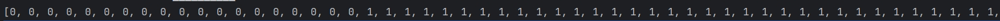
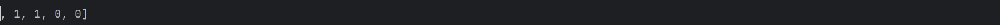

## 文件目录
```
│  classify.py
│  readme.md
│  13-report.pdf
│
└─13-other_files_directory
    │  1-1.png
    │  2-1.png
    │  model.py
    │  test.py
    │  violence_model.ckpt
    │
    ├─violence_224
    │  ├─test
    │  ├─train
    │  └─val

```

## 初始化：
    ckpt_path = "violence_model.ckpt"
    self.model = ViolenceClassifier.load_from_checkpoint(ckpt_path)
    self.trainer = Trainer()
加载测试文件同目录下的已训练模型violence_model.ckpt

## 接口调用实例：

    folder_path = 'violence_224/test'
    img_list = load_images_from_folder(folder_path)

    v = ViolenceClass()
    preds = v.classify(img_list)

    print(preds)
此处通过load_images_from_folder函数将test文件夹中的图片转换为Tensor，调用classify函数输出返回列表，调用实例封装在test.py中

运行test.py结果如下图所示




load_images_from_folder定义如下：
```
def load_images_from_folder(folder_path):
    img_list = []
    transform = transforms.Compose([
        transforms.Resize((224, 224)),  # 调整图像大小为 224x224
        transforms.ToTensor(),  # 将图像转换为Tensor，并归一化至[0, 1]
    ])
    #读取指定目录下图片并转换为Tensor
    for filename in os.listdir(folder_path):
        img_path = os.path.join(folder_path, filename)
        if os.path.isfile(img_path):
            img = Image.open(img_path).convert('RGB')
            img = transform(img)  # 应用定义的转换器
            img_list.append(img)
    return img_list
 ```

 如在git clone时遇到问题，可尝试以下命令后重新clone
 ```
 git config --global http.postBuffer 524288000
 ```